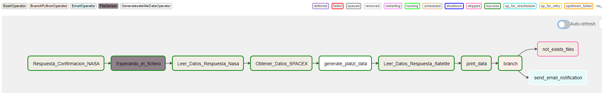

## Install Airflow
necesitas tener docker instalado para hacer esto!
```
curl -LfO 'https://airflow.apache.org/docs/apache-airflow/2.3.3/docker-compose.yaml'
mkdir -p ./dags ./logs ./plugins
echo -e "AIRFLOW_UID=$(id -u)" > .env
AIRFLOW_UID=50000
docker-compose up airflow-ini
# run airflow
docker-compose up
# down airflow
docker-compose down
```

# Proyecto: Platzi explora el espacio

_Los equipos de analistas y marketing de Platzi necesitan datos de los_
_estudiantes que han accedido al satélite e información del historial de_
_eventos de SpaceX, por lo tanto necesitamos que nos ayudes a ejecutar las_
_siguientes tareas._

_1. Esperar a que la NASA nos dé autorización para acceder a los datos del satélite._

_2. Recolectar datos del satélite y dejarlos en un fichero._

_3. Recolectar datos de la API de SpaceX y dejarlos en un fichero._

_4. Enviar un mensaje a los equipos de que los datos finales están disponibles._

## Diagrama



## Código 🚀
```
from airflow import  DAG
from airflow.operators.bash import BashOperator
from airflow.sensors.filesystem import FileSensor
from airflow.operators.python import BranchPythonOperator
from airflow.operators.email_operator import EmailOperator
from generate_data import GeneratesatelliteDataOperator

from datetime import datetime, timedelta
import os
```
### Creacion de DAG
```
default_args = {
    'owner': 'airflow',
    'start_date': datetime(2023, 1, 1),
    'end_date':datetime(2023, 1, 3),
    'max_active_runs':1,
    'schedule_interval':'@daily',
    'depends_on_past': True,
    'retries': 2,
    'retry_delay': timedelta(minutes=1),
    'email': ['frandak2@gmail.com'],
    'email_on_failure': False,
    'email_on_retry': False,
}

with DAG(dag_id="Respuesta_Nasa",
        default_args=default_args,
        description="Comando bash para simular la respuesta de la NASA de confirmación:",
        catchup = False
        ) as dag:
```

### 1 Esperar Respuesta de NASA

```
    t1_1 = BashOperator(
        task_id = "Respuesta_Confirmacion_NASA",
        bash_command='sleep 20 && echo "Confirmación de la NASA, pueden proceder" > /tmp/response_{{ds_nodash}}.txt')

    t1_2 = FileSensor(
        task_id="Esperando_el_fichero",
        filepath="/tmp/response_{{ds_nodash}}.txt"
        )
```
### 2. Recolesctar datos y guardar
```
    t2 = BashOperator(
        task_id = "Leer_Datos_Respuesta_Nasa",
        bash_command='ls /tmp && head /tmp/response_{{ds_nodash}}.txt'
        )
```
### 3. Recolectar datos de la API y guardarlos.
```
    t3 = BashOperator(
        task_id = "Obtener_Datos_SPACEX",
        bash_command="curl https://api.spacexdata.com/v4/launches/past > /tmp/spacex_{{ds_nodash}}.json"
        )
    
    t4 = GeneratesatelliteDataOperator(
        task_id='generate_platzi_data',
        logical_date='{{ds_nodash}}',
        ds_nodash='{{ds_nodash}}',
        dag=dag
    )
    
    t5 = BashOperator(task_id = "Leer_Datos_Respuesta_Satelite",
                    bash_command='ls /tmp && head /tmp/platzi_data_{{ds_nodash}}.csv')

    # Print the data from landing confirmation

    t6 = BashOperator(
        task_id="print_data",
        bash_command="echo {{ task_instance.xcom_pull(task_ids='t5') }}",
    )
```
### 4. Enviar una notoficacion de datos OK.
```
branching = BranchPythonOperator(task_id="branch",python_callable=files_exist)
    
    email_analistas = EmailOperator(
                    task_id='send_email_notification',
                    to='frandak2@gmail.com',
                    subject='los archivos estan listos',
                    html_content="""Hola estimados.\n 
                                    Este correo es una notificación para los analistas donde se les hace saber que los datos de dia: {{ ds }}, ya están disponibles.\n
                                    Un saludo de su orquestador favorito Airflow.""",
                    files=files,
                    cc='frank.montenegro@correounivalle.edu.co',
                    mime_subtype='mixed',
                    dag=dag
    )
    not_exist = BashOperator(
                    task_id = 'not_exists_files',
                    bash_command = "echo at {{ds}} the files not exists"
    )
```